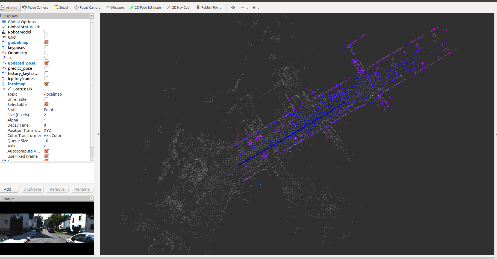
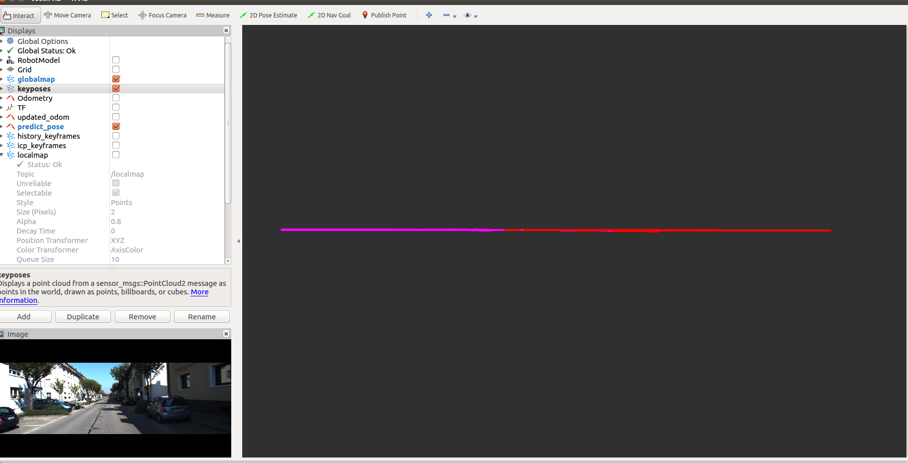

# XCHU_SLAM

## Introduction

xchu_odom添加回环，参考LEGO-LOAM




高度上偏移纠正回来了。



## Dependency

- [GTSAM](https://github.com/borglab/gtsam/releases)(Georgia Tech Smoothing and Mapping library, 4.0.0-alpha2)

## Usage

### Run the package

1. Run the launch file:

```shell
roslaunch xchu_slam  mapping.launch 
```

2. Play existing bag files kitti, bag包播放时请0.1倍速，因为目前性能上还未优化，在bag包播放完成后，建图也将结束，后续将处理成离线的，逐帧处理。ctrl+c关闭终端则自动保存地图。

```shell
rosbag play kitti_2011_10_03_drive_0027_synced.bag --clock -r 0.1
```

## Issues

- 线程安全
- 优化点云配准的初始估计(目前imu和编码器不可用，请设置为false)
- pitch 的累计误差导致高度漂移问题
- 目前位姿有抖动情况，尤其是 z 轴（与定位时的抖动比较像，应该可以一起解决）

## TODOs

- 雷达惯导紧耦合
- 基于GPS的回环检测
